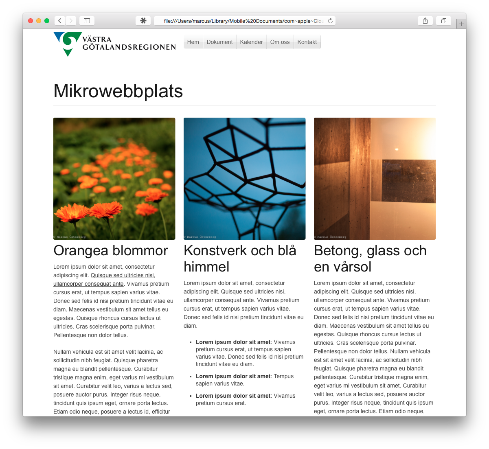
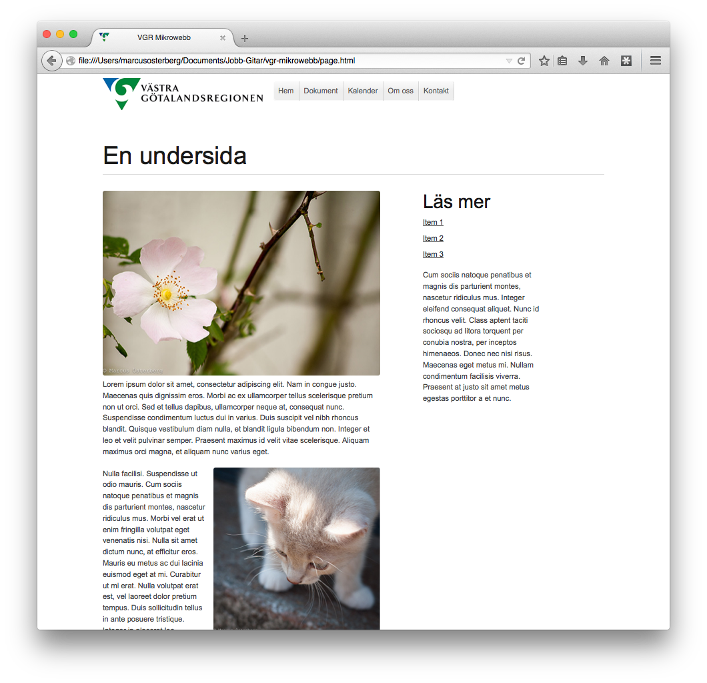
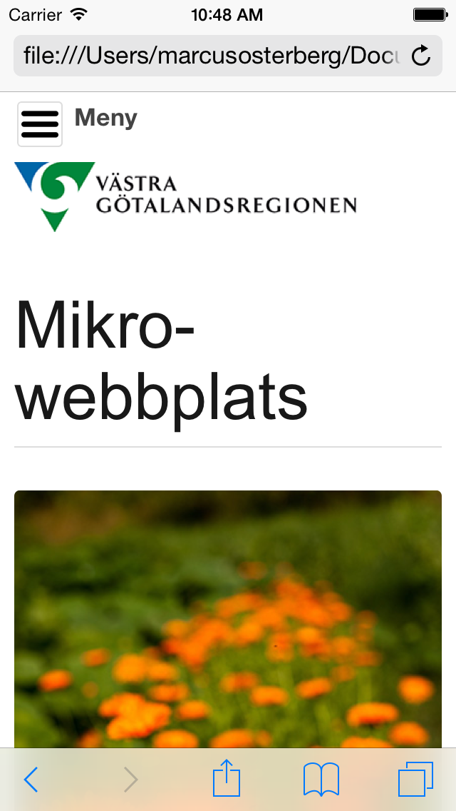
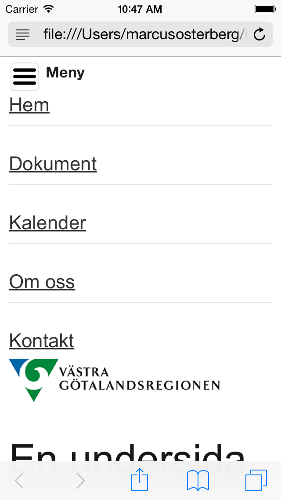

VGR mikrowebb
=============

A HTML mockup of how a microsite may look like. Built for the Swedish regional municipality [Västra Götalandsregionen](http://vgregion.se). 

Definition of _microsite_ according to [Wikipedia](http://en.wikipedia.org/wiki/Microsite):

> "A microsite is an individual web page or a small cluster of pages which are meant to function as a discrete entity within an existing website or to complement an offline activity. The microsite's main landing page can have its own domain name or subdomain."

[A clickable prototype can be found here](http://webbfunktion.com/upload/vgrmikrowebb/).

##The web community's thoughts on microsites##
Microsites might not be the solution you're organisation is looking for. After all, you might end up with hundreds of websites that is hard to merge or manage. Below is what others have to say about microsites.

- [Boagworld podcast: Migrating microsites](http://boagworld.com/season/9/episode/0904/)
- [CreativeBloq: 5 brilliant microsites and why they're so effective](http://www.creativebloq.com/web-design/5-brilliant-microsites-8135477)
- [Boagworld: Do you really need a microsite?](http://boagworld.com/design/microsite/)
- [Digiday: These 4 microsites prove microsites aren’t dead (maybe)](http://digiday.com/brands/microsite-marketing-medium/)

##Screenshots##
###Desktop###

###Smaller width###

